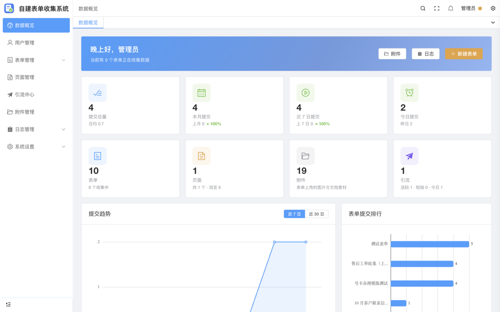
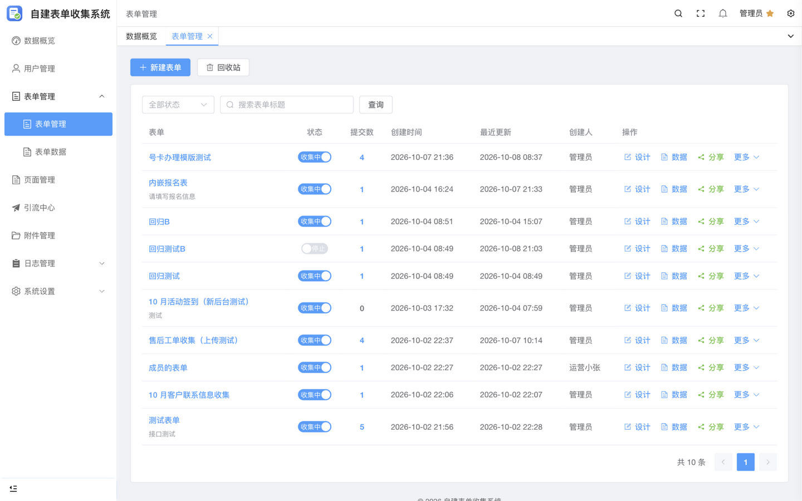
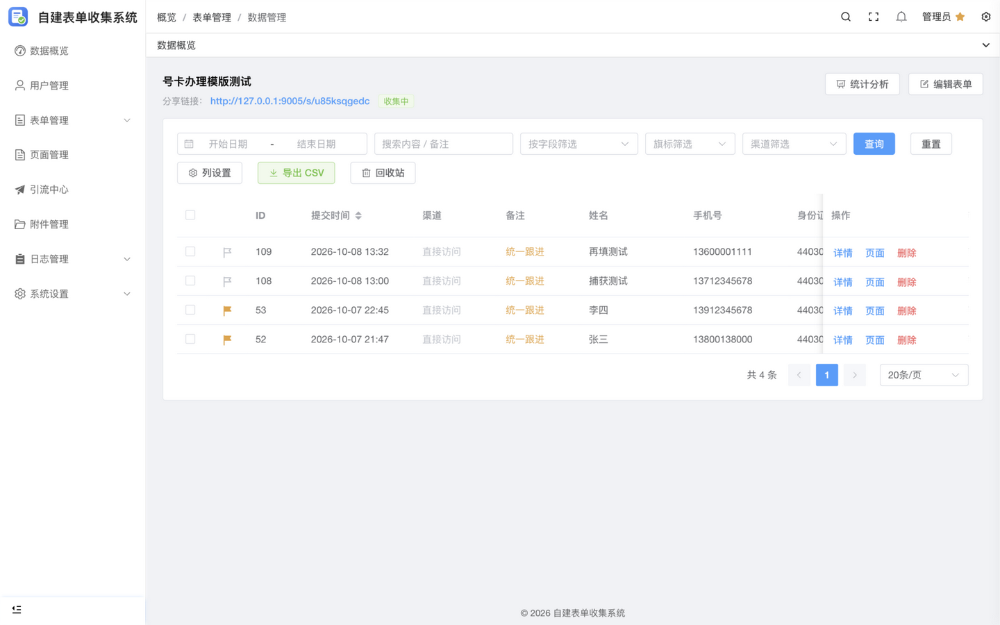
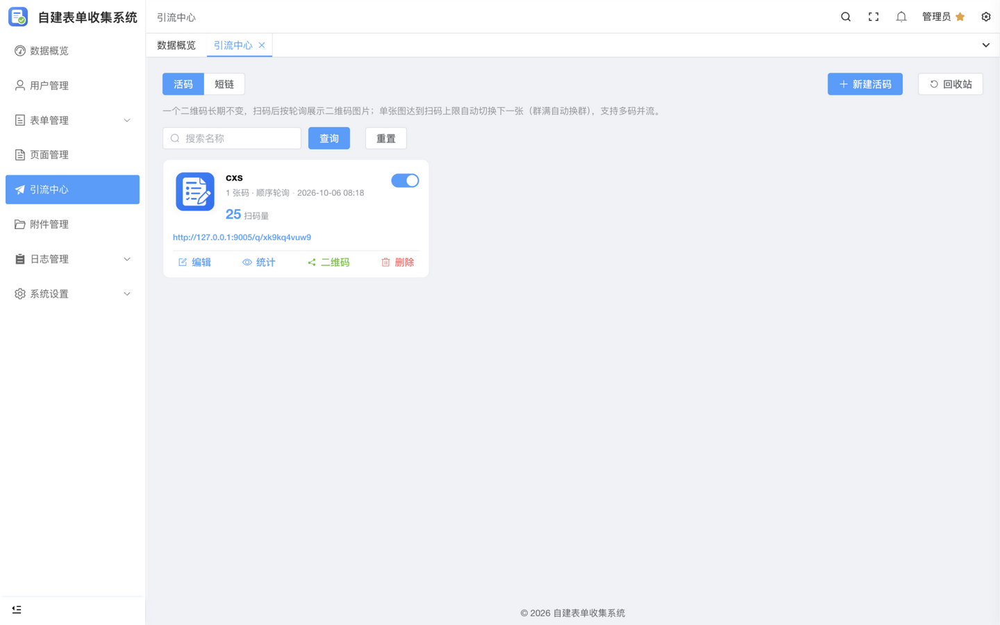
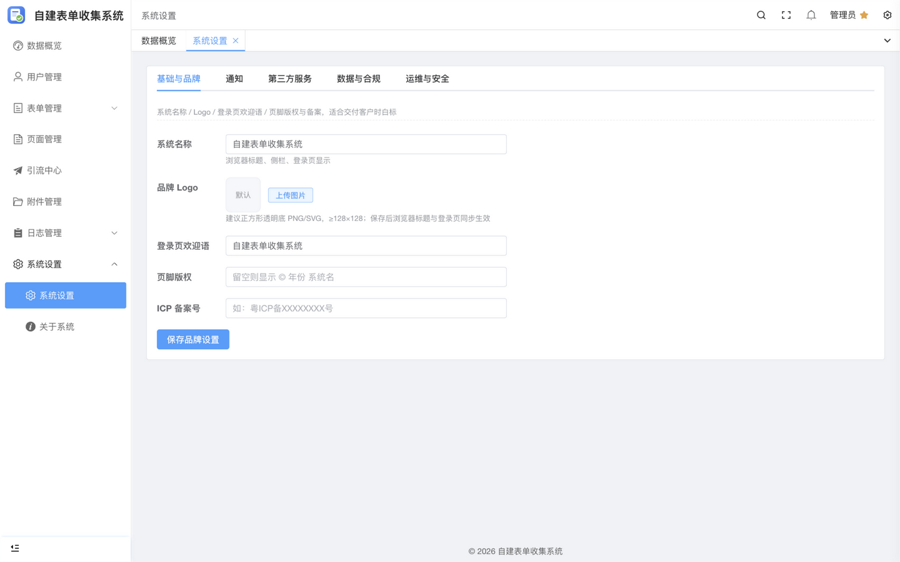
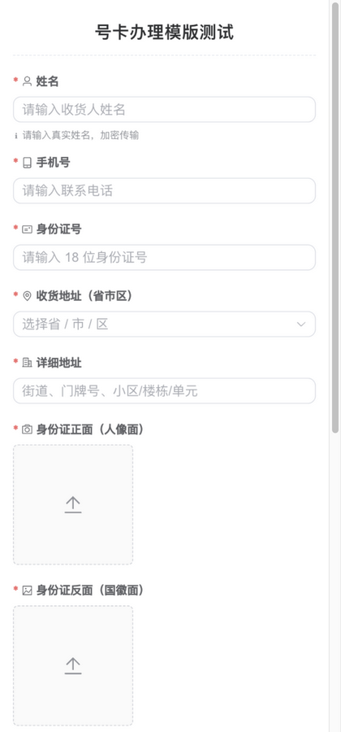

# OwnForm 自建表单收集与私域引流系统

自托管的开源表单收集与私域引流系统：**表单收集**（核心）、**内容页面**、**引流中心**（活码 + 短链）三大模块，数据完全存储在自己的服务器。

## 界面预览

| 数据概览 | 表单管理 |
|---|---|
|  |  |

| 表单数据 | 引流中心 |
|---|---|
|  |  |

| 系统设置 | 访客填表（手机端） |
|---|---|
|  |  |

## 核心模块

| 模块 | 能力 |
|---|---|
| 📋 表单 | 可视化拖拽设计器、图形/短信/极验防刷、审核模式、批量标旗/备注/审核、统计分析、Webhook/邮件/每日汇总通知 |
| 📄 页面 | wangEditor 富文本 + HTML 源码、页面内嵌表单、多套展示模板、SEO 与访问密码 |
| 🔗 引流中心 | 活码（多图轮询、扫码上限自动换群、并流）、短链（多域名轮询、中转引导页）、权重/设备/时段精准分流、长按识别统计、域名池 |
| 🛡️ 数据与合规 | 保留策略自动清理、手动清理（范围/天数自定义）、每日汇总邮件、导出脱敏 |

更多能力：AI 助理（对话式生成表单/页面）、多用户数据隔离、渠道协作与定时上下线、跨表单数据聚合、白标自定义。

## 技术栈

- 后端：ThinkPHP 8（PHP ≥ 8.0）
- 管理端：Vue 3 + Element Plus + form-create + wangEditor v5
- 访客端：原生 Vue 3 UMD（轻量免构建）
- 数据库：MySQL 5.7 / 8.0

## 快速开始

1. 上传发布包到站点，运行目录设为 `/public`（宝塔推荐）
2. 按 `scripts/nginx-site.conf` 配置敏感目录拦截
3. 访问 `/install` 完成安装（自动建表、生成配置与加密主密钥）
4. 安装完成后删除 `install/` 目录
5. （推荐）宝塔计划任务每日执行 `php 站点目录/think cleanup:run`

## 文档

- [系统介绍](docs/系统介绍.md) —— 功能全景、安全设计、版本要点
- [产品销售介绍](docs/产品销售介绍.md) —— 痛点场景、面向人群、功能卖点
- [部署说明（宝塔）](scripts/宝塔部署说明.txt) —— 部署步骤、升级、计划任务

## 安全

内置 CSRF 全覆盖、XSS 双重消毒、SQL 全参数化、SSRF 出站白名单、越权强制隔离、上传内容校验、密钥 AES-256-GCM 加密落库等纵深防御，经多轮完整审计。
